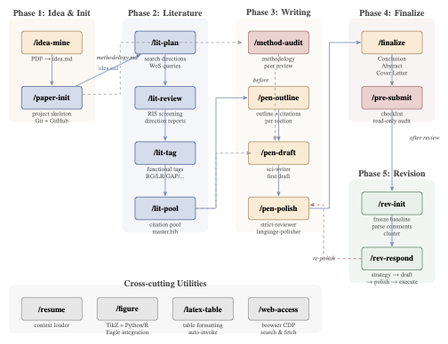

# 科研论文写作技能系统（Claude Code Skills）

基于 [Claude Code](https://docs.anthropic.com/en/docs/claude-code) 的模块化技能系统，覆盖学术论文写作全生命周期——从选题挖掘到审稿回复。



## 流水线概览

整个流水线分为 5 个阶段，每个技能通过斜杠命令（如 `/lit-plan`）在 Claude Code 中调用。

### 阶段一：选题与初始化

| 技能 | 说明 |
|:-----|:-----|
| `/idea-mine` | 从一组 PDF 论文中挖掘可迁移的研究 idea，经审稿人式质控后输出 idea.md |
| `/paper-init` | 初始化论文项目骨架：出版社模板 + Git/GitHub + 三层文档系统 |

### 阶段二：文献

| 技能 | 说明 |
|:-----|:-----|
| `/lit-plan` | 规划文献检索方向，生成 Web of Science 检索式与配额分配 |
| `/lit-review` | 筛选 RIS 导出文献，生成各方向报告与总报告 |
| `/lit-tag` | 为筛选后的文献打功能标签（BG/LR/GAP/...），按研究问题分类 |
| `/lit-pool` | 汇总标签文献为引用池，含引用场景、分级排序，并生成 `master.bib` |

### 阶段三：写作

| 技能 | 说明 |
|:-----|:-----|
| `/method-audit` | 对标已发表论文，审计方法论问题，提出结构/模型/图表的优化建议 |
| `/pen-outline` | 交互式构建章节大纲（论点 + 引文），为起草提供高质量输入 |
| `/pen-draft` | 从大纲自动生成初稿，通过 journal-scout 和并行 sci-writer agent 完成 |
| `/pen-polish` | 迭代打磨：strict-reviewer 反馈 → 用户确认 → 修改 → language-polisher 润色 |

### 阶段四：定稿

| 技能 | 说明 |
|:-----|:-----|
| `/finalize` | 定稿三步曲：Conclusion → Abstract → Cover Letter，交互式确认 + 语言润色 |
| `/pre-submit` | 投稿前终检：引用完整性、自引率、格式合规、图表规范、符号一致性 |

### 阶段五：修改

| 技能 | 说明 |
|:-----|:-----|
| `/rev-init` | 初始化修改工作流：冻结基准 → 解析决定信 → 聚类评审意见 → 搭建回复骨架 |
| `/rev-respond` | 逐条审稿回复闭环：策略对齐 → 内容起草 → 语言润色 → 执行写入 |

### 跨阶段工具

| 技能 | 说明 |
|:-----|:-----|
| `/resume` | 新 session 快速加载项目上下文 |
| `/figure` | 学术图表全流程：自动判断 TikZ/Python/R，创建或美化图表，Eagle 风格参考 |
| `/latex-table` | LaTeX 表格格式化与模板（兼容 Elsarticle） |
| `/web-access` | 联网操作：搜索、网页抓取、登录后操作、浏览器 CDP |

## 安装

将本仓库克隆到 Claude Code 配置目录：

```bash
git clone https://github.com/zylen97/claude-config.git ~/.claude
```

Claude Code 会自动从 `~/.claude/skills/` 发现所有技能。

## 设计原则

- **Markdown 优先**：所有内容先写入章节 `.md` 文件，用户确认后才写入 `manuscript.tex`
- **不可跳步，可以回改**：阶段必须按顺序推进，但随时允许回溯修改
- **交互式确认**：每个技能在关键决策点暂停，等待用户确认后再继续
- **并行 Agent 加速**：计算密集步骤（文献筛选、方法论对标）分发并行子 agent 提速

## 许可证

MIT
