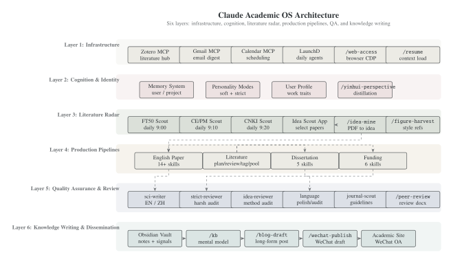
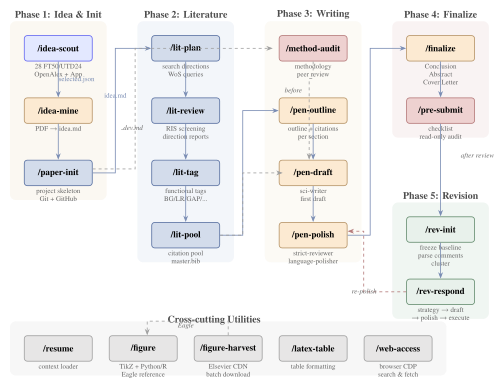

# Claude Academic OS

A personal academic operating system built on [Claude Code](https://docs.anthropic.com/en/docs/claude-code) — 39 skills, 8 specialized agents, and an 80-journal daily literature radar covering the full research lifecycle from intelligence gathering to knowledge dissemination.

## System Architecture

<p align="center">
  
</p>

## Layer 3: Literature Radar

An automated intelligence-gathering system that scans 80 journals daily. Scanner code lives in [`idea-scout/pipeline`](https://github.com/zylen97/idea-scout).

| Scanner | Journals | Schedule | Source | Recipients |
|:--------|:---------|:---------|:-------|:-----------|
| **FT50 Scout** | 25 FT50/UTD24 | Daily 9:00 | OpenAlex + LLM translation | 3 |
| **CE/PM Scout** | 12 CE/PM | Daily 9:10 | OpenAlex + LLM translation | 4 |
| **CNKI Scout** | 43 Chinese core | Daily 9:20 | CNKI RSS | 1 |

**Flow**: launchd triggers [`idea-scout`](https://github.com/zylen97/idea-scout) pipelines → OpenAlex/RSS fetch → LLM translates abstracts → email digest → [Idea Scout App](https://zylen97.github.io/idea-scout/) displays → user selects → `/idea-mine` analyzes

| Skill | Description |
|:------|:------------|
| `/idea-scout` | Manage FT50/UTD24 scanning configuration, trigger manual scans, sync App data |
| `/figure-harvest` | Batch harvest figures from Elsevier journals for style reference library |

## Layer 4: Production Pipelines

### English Paper Pipeline (14 skills)

The core pipeline, from idea to revision response. Each skill is invoked via slash command in Claude Code.

<p align="center">
  
</p>

**Phase 1: Idea & Init**

| Skill | Description |
|:------|:------------|
| `/idea-mine` | Deep-dive selected PDFs to extract transferable research ideas → `idea.md` |
| `/paper-init` | Initialize project skeleton: 6 publisher templates + Git/GitHub + 3-layer document system |

**Phase 2: Literature** (shared with Dissertation & Funding pipelines)

| Skill | Description |
|:------|:------------|
| `/lit-plan` | Plan search directions, generate Web of Science / CNKI queries with quota allocation |
| `/lit-review` | Screen RIS exports (WoS + CNKI dual-track), generate per-direction and summary reports |
| `/lit-tag` | Tag screened papers by function (BG/LR/GAP/...), classify by research question |
| `/lit-pool` | Aggregate into citation pool with usage scenarios, tier ranking + `master.bib`, Zotero sync |

**Phase 3: Writing** (dual-track: Technical + Narrative)

| Skill | Description |
|:------|:------------|
| `/method-audit` | Benchmark against published papers, audit methodology issues, fix and rewrite |
| `/method-end` | Distill mature `_dev.md` into publication-ready chapter markdown |
| `/pen-outline` | Interactively build sentence-level outlines (arguments + citation forms) |
| `/pen-draft` | Generate first draft from outline via journal-scout + parallel sci-writer agents |
| `/pen-polish` | Iterative polish: strict-reviewer → user confirm → revise → language-polisher |

**Phase 4: Finalize**

| Skill | Description |
|:------|:------------|
| `/finalize` | Conclusion → Abstract → Cover Letter → Structure cleanup (remove scaffolding) |
| `/pre-submit` | Pre-submission checklist: citation integrity, self-citation rate, formatting, symbol consistency |

**Phase 5: Revision**

| Skill | Description |
|:------|:------------|
| `/rev-init` | Freeze baseline → parse decision letter → cluster comments → scaffold response letter |
| `/rev-respond` | Per-comment response loop: strategy alignment → draft → polish → execute |

**Cross-cutting**

| Skill | Description |
|:------|:------------|
| `/idea-refine` | Interactive idea & method design iteration with idea-reviewer agent (phase-aware: reviews idea.md, `_dev.md`, or manuscript.tex depending on project stage) |
| `/figure` | Academic figure workflow: auto-select TikZ/Python/R, create or beautify, Eagle style reference, cross-figure consistency check |
| `/latex-table` | LaTeX table formatting & templates (Elsarticle compatible) |

### Dissertation Pipeline (5 skills)

For supervising graduate theses — rewrite and expand published English papers into Chinese dissertations (not translation).

```
/diss-init → /diss-outline → /diss-draft → /diss-polish → /diss-finalize
```

| Skill | Description |
|:------|:------------|
| `/diss-init` | Interactive chapter skeleton: read source project → confirm 3-level headings → word allocation → create chapter files |
| `/diss-outline` | Per-chapter expansion outline: detailed writing points + content source annotation (rewrite/expand/new) |
| `/diss-draft` | Per-chapter Chinese academic writing via sci-writer-zh agent (not translation — restructures for Chinese conventions) |
| `/diss-polish` | Chinese language polish via language-polisher-zh agent: academic register, terminology consistency, logical flow |
| `/diss-finalize` | CN/EN abstracts + acknowledgments + format audit (headers, figure numbering, bibliography format) |

### Funding Application Pipeline (6 skills)

For research grant proposals — synthesize 2-3 existing projects into a persuasive application.

```
/fund-mine → /fund-init → /fund-outline → /fund-draft → /fund-review → /fund-polish
```

| Skill | Description |
|:------|:------------|
| `/fund-mine` | Idea mining from existing projects + papers + funding guidelines → confirm research direction |
| `/fund-init` | Initialize project: link source projects, select template by grant type (NSFC / provincial / institutional) |
| `/fund-outline` | Per-section outline: rationale, research content, technical roadmap, innovation, feasibility |
| `/fund-draft` | Per-section Chinese academic writing via sci-writer-zh agent |
| `/fund-review` | Simulated expert panel scoring: point-by-point audit against evaluation criteria |
| `/fund-polish` | Chinese polish + persuasion enhancement + format compliance check |

## Layer 5: Quality Assurance

Eight specialized agents that skills dispatch as sub-agents. They are not invoked directly — skills orchestrate them.

| Agent | Role | Used by |
|:------|:-----|:--------|
| `sci-writer` | Academic English writer, journal-aware | `/pen-draft` |
| `sci-writer-zh` | Chinese academic writer (not translator) | `/diss-draft`, `/fund-draft` |
| `strict-reviewer` | Harsh peer reviewer simulation | `/pen-polish` |
| `idea-reviewer` | Idea & method design auditor | `/idea-refine` |
| `language-polisher` | English prose polish (grammar, flow, Chinglish patterns) | `/pen-polish`, `/finalize` |
| `language-auditor` | Systematic 18-item category audit (3 groups, parallel, read-only) | `/pen-polish`, `/finalize`, `/rev-respond` |
| `language-polisher-zh` | Chinese prose polish (register, terminology, coherence) | `/diss-polish`, `/fund-polish` |
| `journal-scout` | Fetch target journal guidelines & conventions | `/pen-draft`, `/pen-polish` |

## Layer 6: Knowledge Dissemination

The knowledge dissemination layer includes a personal values knowledge base (`/kb`) backed by an Obsidian vault with 8 theme files, a living mental model (`_mental-model.md`), and a writing craft guide. The mental model evolves with each ingest cycle and serves as the cognitive foundation for blog writing and WeChat publishing.

| Skill | Description |
|:------|:------------|
| `/blog-draft` | Generate long-form blog posts from Obsidian value notes + NB2 cover images → Academic Site |
| `/wechat-publish` | Adapt blog posts and push to WeChat Official Account draft box |
| `/kb` | Personal values knowledge base with 3 modes: `ingest` (batch import with content filtering + parallel sub-agents), `lint` (health check: contradictions, duplicates, format, sensitive content), `model` (view/update living mental model `_mental-model.md`). Supports pre-classification + parallel sub-agent integration for large batches |
| `/peer-review` | Act as journal reviewer: read manuscript PDF, generate structured review comments to Word |

## Utilities

| Skill | Description |
|:------|:------------|
| `/resume` | Quick-load project context for new Claude Code sessions |
| `/web-access` | Browser CDP: search, fetch, login-required pages, CNKI/social media scraping |

## Companion Apps

| App | Description | Link |
|:----|:------------|:-----|
| **Idea Scout** | Full-stack academic paper radar: 80-journal daily scanning pipeline + Flutter PWA for browsing/selecting. 3 sources, email digests, GitHub sync | [Live](https://zylen97.github.io/idea-scout/) · [Repo](https://github.com/zylen97/idea-scout) |
| **Claude Usage Dashboard** | Python dashboard for monitoring Claude Code token usage and cost tracking | Local `http://127.0.0.1:8080` |
| **Twitter Bookmark Exporter** | Node.js CLI to export all Twitter/X bookmarks via CDP network interception. Zero dependencies | [Repo](https://github.com/zylen97/twitter-bookmark-exporter) |
| **Academic Site** | Personal academic website with Publications, Blog, Projects, Life pages. Built with Astro | [Live](https://zylen97.github.io/academic-site/) |

## Installation

Clone this repo to the Claude Code config directory:

```bash
git clone https://github.com/zylen97/claude-academic-os.git ~/.claude
```

Claude Code auto-discovers all skills from `~/.claude/skills/` and agents from `~/.claude/agents/`.

> **Note**: `CLAUDE.md`, `settings.json`, and `memory/` are gitignored — these contain personal instructions and are not part of the shared system.

## Directory Structure

```
~/.claude/
├── CLAUDE.md                 # Personal instructions (gitignored)
├── settings.json             # Claude Code settings (gitignored)
├── memory/                   # Persistent memory system (gitignored)
├── agents/                   # 8 specialized sub-agents
│   ├── sci-writer.md         # English academic writer
│   ├── sci-writer-zh.md      # Chinese academic writer
│   ├── strict-reviewer.md    # Peer reviewer
│   ├── idea-reviewer.md      # Idea & method auditor
│   ├── language-polisher.md  # English polisher (editing)
│   ├── language-auditor.md   # English auditor (systematic checklist, read-only)
│   ├── language-polisher-zh.md # Chinese polisher
│   └── journal-scout.md      # Journal guidelines
├── skills/                   # 39 slash-command skills
│   ├── idea-scout/           # Literature radar management
│   ├── paper-init/           # Project scaffolding (6 publishers, 4 method types)
│   ├── lit-*/                # Literature pipeline (4 skills)
│   ├── pen-*/                # Writing pipeline (3 skills)
│   ├── rev-*/                # Revision pipeline (2 skills)
│   ├── diss-*/               # Dissertation pipeline (5 skills)
│   ├── fund-*/               # Funding pipeline (6 skills)
│   ├── blog-draft/           # Blog generation
│   ├── wechat-publish/       # WeChat publishing
│   ├── kb/                   # Personal knowledge base (ingest/lint/model)
│   └── shared/               # Shared utilities (Python)
# scheduled/ → github.com/zylen97/idea-scout/pipeline
└── config/                   # Runtime state
```

## Design Principles

- **Markdown first** — All content goes into chapter `.md` files; only written to `manuscript.tex` after explicit user confirmation
- **No skipping, free backtracking** — Pipeline phases proceed in order, but revisions to earlier stages are always allowed
- **Interactive confirmation** — Every skill pauses at critical decision points; no silent overwrites
- **Parallel agents** — Computation-heavy steps dispatch parallel sub-agents (literature screening across directions, multi-section drafting)
- **Dual-track writing** — Technical chapters via `/method-end` → `/pen-draft`; Narrative chapters via `/pen-outline` → `/pen-draft` — both tracks converge at the same drafting skill
- **Pipeline reuse** — Literature pipeline (`/lit-*`) is shared across English papers, dissertations, and funding applications
- **Phase-aware intelligence** — Skills like `/idea-refine` automatically detect project stage and review the appropriate artifact (idea.md → `_dev.md` → manuscript.tex)

## License

MIT
